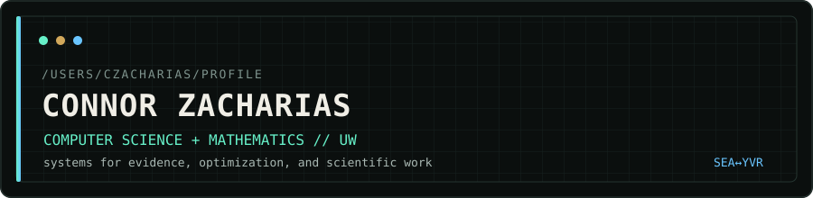
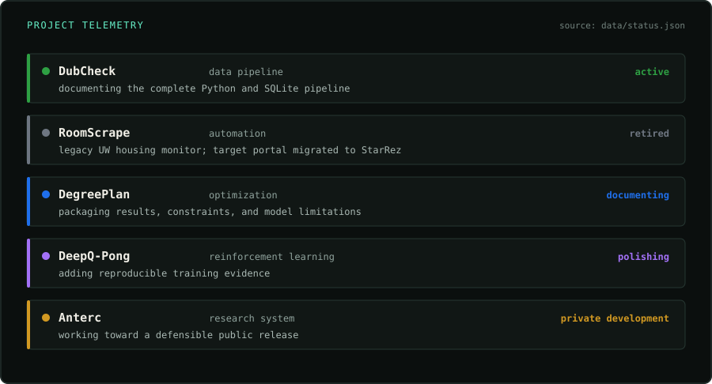

  

  

Building software for accessible information distribution.

`research computing` · `data systems` · `optimization` · `machine learning`

## `/selected-work`

### [DubCheck](https://github.com/czacharias/DubCheck)

A local-first UW course-planning pipeline that turns catalog and historical grade data into comparable course options. Python, SQLite, browser automation, and explicit data provenance.

### [DegreePlan](https://github.com/czacharias/Math381Proj)

Risk-aware degree planning as a mixed-integer optimization problem: graduation constraints, predicted grades, schedule efficiency, and uncertainty in one inspectable model.

### [DeepQ-Pong](https://github.com/czacharias/deepq-pong)

A from-scratch Deep Q-Network experiment for Pong, built to make replay buffers, target networks, exploration schedules, and training behavior understandable.

### Anterc

A biomedical literature and evidence pipeline under active private development. I will publish it when the product and its validation story are ready to stand on their own.

## `/system-status`

  

The panel and project badges above are generated from [`data/status.json`](./data/status.json), so the profile has one source of truth instead of hand-edited status labels.

## `/reading`

Papers behind the things I am building, resolved from DOI metadata through Crossref.

<!-- READING:START -->
- [Human-level control through deep reinforcement learning](https://doi.org/10.1038/nature14236) — *Nature* (2015)
  Deep Q-learning foundation for DeepQ-Pong.
<!-- READING:END -->

## `/research-interests`

Research computing, pharmacology, optimization, reliable AI/data systems, and the infrastructure that makes computational work reproducible.

## `/off-hours`

Exercise physiology & strength training, guitar, 7s rugby, philosophy & speculative fiction

`Seattle WA ↔ Kelowna BC` · `go dawgs`

